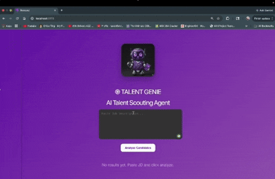

# ֎ TALENT GENIE - AI Talent Scouting Agent
<p align="center">
  
</p>
An AI-powered recruitment assistant that analyzes resumes, ranks candidates, and simulates real interview conversations — all in seconds.

---

<p align="center">
  
</p>

## 🚀 Problem

Recruiters spend hours:

* Manually screening resumes
* Matching skills with job descriptions
* Conducting repetitive initial interviews

This process is slow, inefficient, and hard to scale.

---

## 💡 Solution

**AI Talent Agent** automates the entire pipeline:

✅ Parses resumes automatically
✅ Extracts and matches skills with Job Description
✅ Ranks candidates using AI scoring
✅ Simulates recruiter–candidate conversations
✅ Provides explainable hiring insights

---

## ✨ Key Features

### 📄 Resume Parsing

* Extracts text from PDF resumes
* Identifies relevant skills using controlled AI prompts

### 🎯 Smart Skill Matching

* Matches candidate skills with JD
* Identifies missing skills
* Generates match score

### 💬 AI Interview Simulation

* Generates technical questions
* Simulates candidate answers
* Displays structured chat UI

### 📊 Candidate Ranking

* Combines:

  * Match Score (70%)
  * Interest Score (30%)
* Outputs ranked candidate list

---

## 🧠 Tech Stack

### 🔹 Backend

* Python 3.13
* FastAPI
* Groq API (LLaMA 3.1)
* PyPDF2

### 🔹 Frontend

* React (Vite)
* Axios
* Custom UI with chat modal

---

## 🏗️ Architecture Overview

```id="arch1"
User Input (JD)
      ↓
Skill Extraction (LLM)
      ↓
Resume Parsing (PDF)
      ↓
Skill Matching Engine
      ↓
AI Interview Simulation
      ↓
Final Ranking Output
```

---

## ⚙️ Installation

### 🔹 Prerequisites

* Python 3.13+
* Node.js & npm
* Groq API key

---

### 🔹 Backend Setup

```bash id="b1"
cd backend
python -m venv .venv
source .venv/bin/activate   # Windows: .venv\Scripts\activate
pip install -r requirements.txt
```

Create `.env` file:

```id="env1"
GROQ_API_KEY=your_api_key_here
```

Run server:

```bash id="b2"
uvicorn main:app --reload --port 8001
```

---

### 🔹 Frontend Setup

```bash id="f1"
cd frontend
npm install
npm run dev
```

---

## 🧪 How It Works

1. Enter Job Description
2. Click **Analyze Candidates**
3. System:

   * Extracts skills
   * Matches resumes
   * Generates interview chats
4. View ranked candidates
5. Open chat to see AI interview

---

## 📊 Sample API

### POST `/analyze`

```json id="api_req"
{
  "jd": "Looking for a Python backend developer"
}
```

### Response

```json id="api_res"
[
  {
    "name": "Chirag Sharma",
    "final_score": 85,
    "match_score": 100,
    "interest_score": 50,
    "matched_skills": ["python", "fastapi"],
    "missing_skills": [],
    "reason": "Strong match for backend role"
  }
]
```

---
🌐 Application URLs

Frontend (React App)
Runs on:

http://localhost:5173

Backend (FastAPI Server)
Runs on:

http://127.0.0.1:8001

🔗 How They Connect

The frontend sends API requests to the backend at http://127.0.0.1:8001/analyze using Axios.

## 📂 Project Structure

```id="struct1"
talent-agent/
├── backend/
│   ├── main.py
│   ├── data/resumes/
│   └── requirements.txt
│
├── frontend/
│   ├── src/
│   │   ├── App.jsx
│   │   └── assets/
│
└── README.md
```

---

## 🚀 Future Improvements

* 📊 Skill gap visualization dashboard
* As there are no live candidates so I have shown a conversation between an AI Recruiter Agent and AI Candidate Agent. The Candidate Agent will be replaced by real candidates.
* 🏆 Top candidate highlight
* 💬 Real-time streaming chat
* 📄 Resume preview in UI
* 🔍 Advanced filtering

---

## 👩‍💻 Author

**Khushi Priya Srivastava**

---

## 🏆 Why This Project Stands Out

* End-to-end AI recruitment pipeline
* Combines NLP + ranking + chat simulation
* Clean UI with real interview experience
* Scalable and production-ready architecture

---

## 📌 Notes

* Resumes should be placed in `backend/data/resumes/`
* Ensure backend is running before frontend

---

## ⭐ Impact

Reduces recruiter effort from **hours → seconds**
and enables faster, smarter hiring decisions using AI.

## 📸 Demo Screens

### 🏠 Home Page
<p align="center">
  
</p>

### 💬 Chat Interface
<p align="center">
  
</p>

### 📊 Results
<p align="center">
  
</p>

📥 Sample Input (Job Description)
We are seeking an innovative C++ Developer to design and develop high-end applications.

Key Responsibilities:
- Develop efficient and reliable C++ code
- Optimize performance and memory usage
- Collaborate with cross-functional teams
- Debug and upgrade existing systems

Required Skills:
- Strong proficiency in C++
- Knowledge of STL and modern C++ standards
- Understanding of multithreading and memory management
- Experience with Git and testing frameworks
📤 Sample Output
[
  {
    "name": "Ajaydeep",
    "final_score": 82.5,
    "match_score": 90,
    "interest_score": 60,
    "matched_skills": ["c++", "multithreading", "git"],
    "missing_skills": ["stl"],
    "reason": "Strong C++ background with good system-level understanding"
  },
  {
    "name": "Sanchita Samman",
    "final_score": 70,
    "match_score": 75,
    "interest_score": 60,
    "matched_skills": ["c++"],
    "missing_skills": ["multithreading", "git"],
    "reason": "Basic C++ knowledge but lacks system-level experience"
  }
]
💬 Sample AI Interview Chat
Recruiter: What is your experience with multithreading in C++?

Ajaydeep: I have worked on concurrent systems using threads and mutex locks to ensure safe execution...

Recruiter: How do you handle memory management in C++?

Ajaydeep: I use smart pointers and follow RAII principles to avoid memory leaks.
